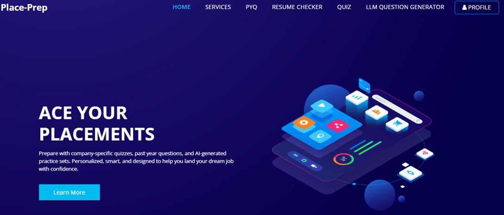
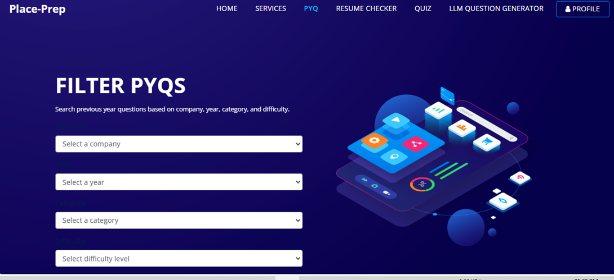
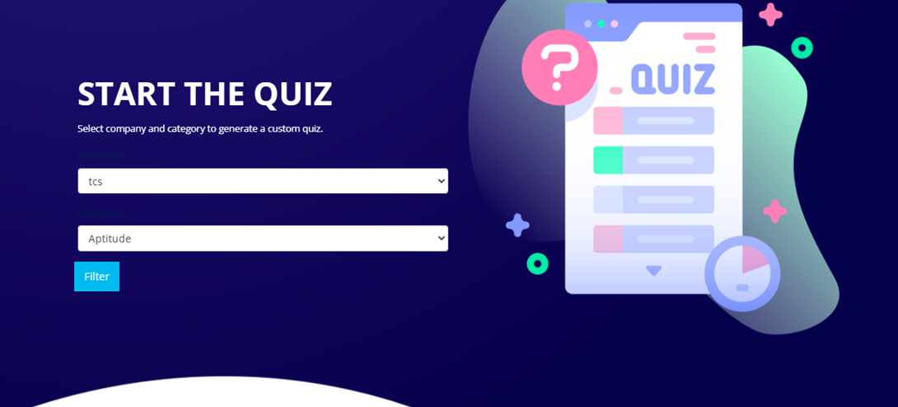
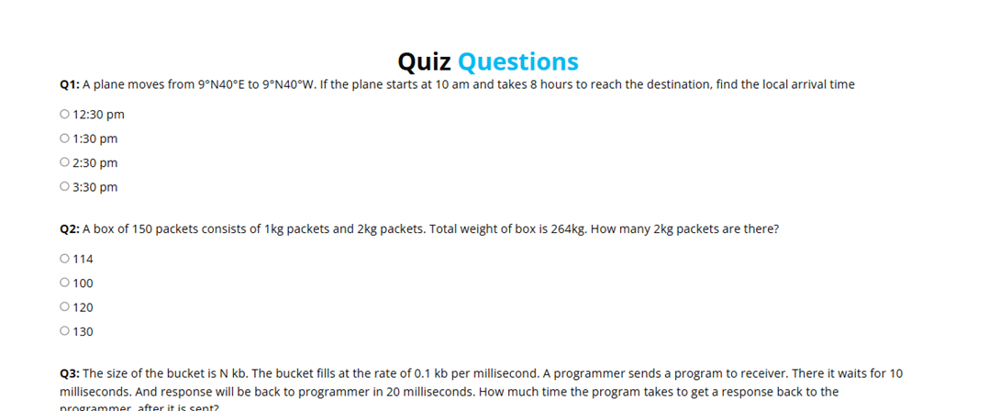
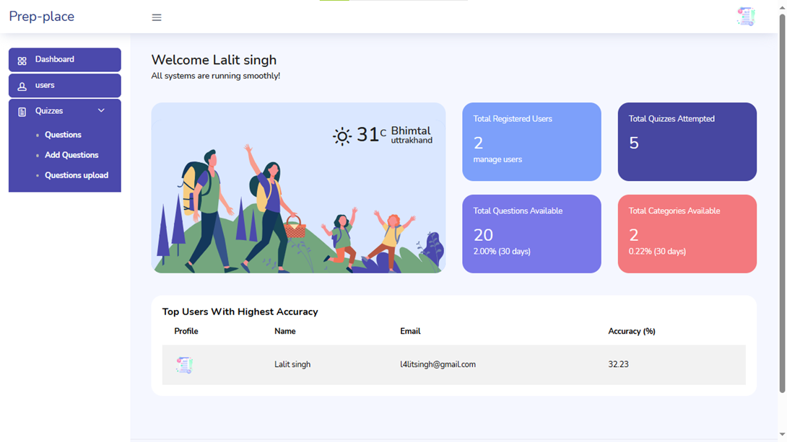

# Prep-place

**Prep-Place** is a Flask-based placement preparation platform that offers quizzes, previous year questions (PYQs), and a mock interview system. It also includes an admin panel to manage quiz content efficiently.

---

## 🚀 Features

✅ User quizzes and PYQs  
✅ AI-generated quiz questions using LLMs  
✅ Admin panel for managing quizzes  
✅ PDF upload to extract and insert questions  
✅ Resume upload for improvement suggestions  
✅ Mock interview system with voice interaction

---

## 🛠️ Tech Stack

- **Backend:** Flask  
- **Database:** Firebase Firestore  
- **AI & NLP:** Groq (LLMs)  
- **Authentication:** Firebase Auth  
- **Hosting:** AWS  

---

## 🔥 Firestore Database Structure

### 1️⃣ `users` Collection

Stores registered user details.

- **Document ID**: User's email address (e.g., `user@example.com`)
- **Fields**:
  - `full_name`: `string` – Full name of the user.
  - `email`: `string` – User's email.
  - `college_name`: `string` – College name.
  - `degree`: `string` – Degree pursued.
  - `branch`: `string` – Branch/stream.
  - `year_of_graduation`: `integer` – Graduation year.
  - `profile_image_url`: `string` – URL of profile image.
  - `total_attempted_quizzes`: `integer` – Total quizzes attempted.
  - `total_accuracy`: `float` – Average accuracy of the user.
  - `created_at`: `timestamp` – User creation timestamp.
  - `is_admin`: `boolean` – Admin status (default: `false`).

---

### 2️⃣ `user_stats` Collection

Tracks individual quiz performance per user.

- **Document ID**: User's email address (e.g., `user@example.com`)
- **Subcollection**: `attempts`
  - **Document ID**: `{company}_{category}` (e.g., `Amazon_Technical`)
  - **Fields**:
    - `email`: `string` – User's email.
    - `company`: `string` – Company name.
    - `category`: `string` – Quiz category.
    - `total_questions`: `integer` – Total questions attempted.
    - `correct_answers`: `integer` – Correct answers count.
    - `accuracy`: `float` – Accuracy percentage.
    - `incorrect_questions`: `list` – List of incorrectly answered questions.

---

### 3️⃣ `questions` Collection

Contains all quiz questions.

- **Document Structure**: Each quiz question is stored as a document.
- **Fields**:
  - `company`: `string` – Company name.
  - `question_text`: `string` – Question text.
  - `options`: `array` – List of 4 options.
  - `answer`: `string` – Correct answer.
  - `explanation`: `string` – Explanation for the correct answer.
  - `category`: `string` – Category of the quiz.
  - `topic`: `string` – Topic of the question.
  - `difficulty`: `string` – Difficulty level (e.g., Easy, Medium, Hard).
  - `year`: `string` – Year of the question.

---


## ⚙️ Setup Instructions

### 1️⃣ Clone the Repository

```bash
git clone https://github.com/LalitSingh07/prep-place.git
cd prep-place
python3 -m venv venv
source venv/bin/activate  # On Windows: venv\Scripts\activate
```
### 2️⃣ Install Dependencies

```bash
pip install -r requirements.txt
```
### 3️⃣ Configure Environment Variables
Create a `.env` file in the root directory and add your Firebase and Groq credentials:

```plaintext
SECRET_KEY= 'your_secret_key'
FIREBASE_WEB_API_KEY= 'your_firebase_web_api_key'
GROQ_API_KEY= 'your_groq_api_key'
```


### 4️⃣ Configure Firebase

### a. Create a Firebase Project

- Go to the [Firebase Console](https://console.firebase.google.com/).
- Click **"Add project"** and follow the steps to create your project.

---

### b. Enable Firestore

- In the **Firestore Database** tab, click **"Create Database"** and select a region.
- Start in **test mode** for development.

---

### c. Enable Email/Password Authentication

- Go to the **Authentication** section.
- Click **"Get started"**.
- Under **Sign-in method**, enable **Email/Password**.

---

### d. Create Test Users (Optional)

- In **Authentication > Users**, click **"Add user"**.
- Enter an email and password (e.g., `test@example.com` / `password123`) to test locally.

---

### e. Service Account Key

- Go to **Project Settings > Service Accounts**.
- Click **"Generate new private key"** to download `serviceAccountKey.json`.
- Rename the `serviceAccountKey.json` to `placeprepjsonkey.json` and place in your project root directory.

### ⚙️ Make a User an Admin to Add Questions

By default, users are not admins and cannot add questions through the admin panel. To grant a user admin access:

1. Go to your Firestore console.
2. Navigate to the **users** collection.
3. Find the document for the specific user you want to make an admin.
4. Edit the document and set:
   ```json
   "is_admin": true
    ```
5. Save the changes.
### 5️⃣ Run the Application
```bash
python app.py
```
### 6️⃣ Access the Application
Open your web browser and go to `http://localhost:5000`.
### 7️⃣ Access the Admin Panel
To access the admin panel, log in with an admin account. If you haven't set up an admin user, follow the instructions in the **Make a User an Admin** section above.
### 8️⃣ Upload Questions via PDF
To upload questions from a PDF file:
1. Navigate to the admin panel.
2. Click on the "Upload Questions" section.
3. Select a PDF file containing questions.
4. Click "Upload" to extract and insert questions into the database.


---

## 🗣️ Voice Interaction System (TTS & STT)

Prep-Place features a voice-based **Mock Interview System** that simulates a real interview environment by allowing verbal communication between the user and the AI interviewer.

---

### 🔊 Text-to-Speech (TTS)

- Converts LLM-generated text into human-like speech.
- Audio responses from the virtual interviewer are generated and played back to the user.
- Helps create a more immersive and realistic interview experience.

---

### 🎙️ Speech-to-Text (STT)

- Captures the user's spoken answers and converts them into text.
- Supports audio input from browser-based recording (e.g., `.webm`, `.ogg`).
- Enables seamless voice-driven interaction with the LLM interviewer.

---

### ⚠️ FFmpeg Requirement

To enable audio format conversion (e.g., from `.webm`/`.ogg` to `.wav`) which is necessary for accurate speech-to-text processing:

- **Install FFmpeg** and ensure it is added to your system's PATH.
- FFmpeg is critical for decoding and converting audio formats before transcription.
- Without FFmpeg, the STT functionality will not work properly.

👉 Download FFmpeg from: [https://ffmpeg.org/download.html](https://ffmpeg.org/download.html)

---

### 9️⃣ Screen Shots






# 🔗 [Demo](https://lalitsingh07.github.io/prep-place/) (hosted on EC2) (MockInterviewer Not Added)